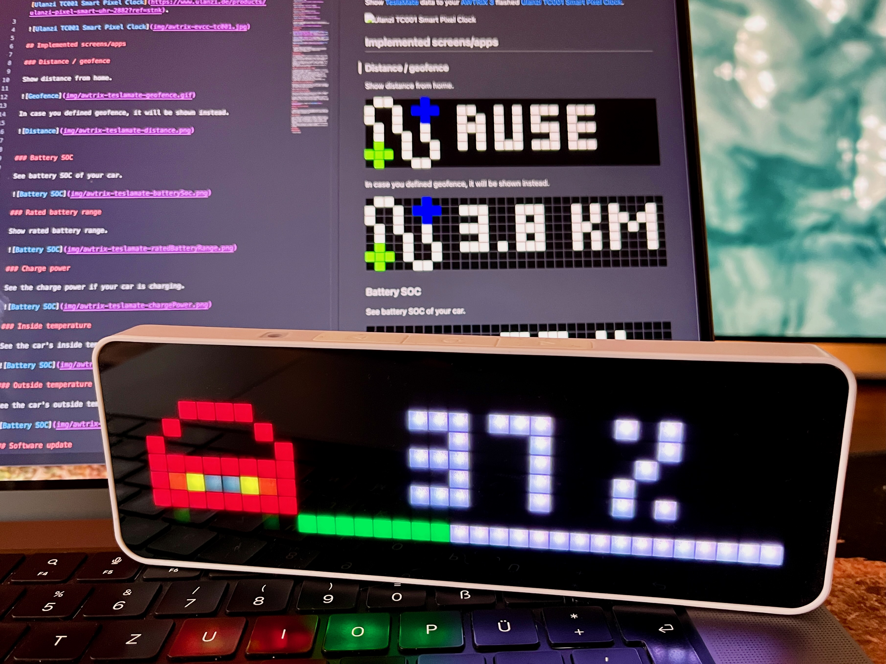
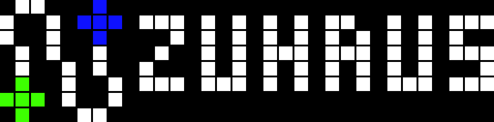
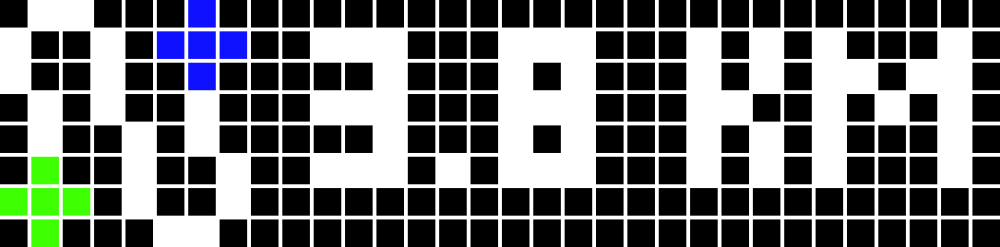
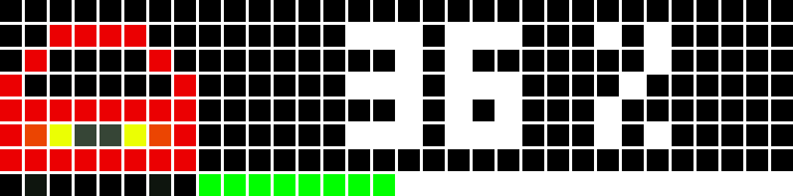
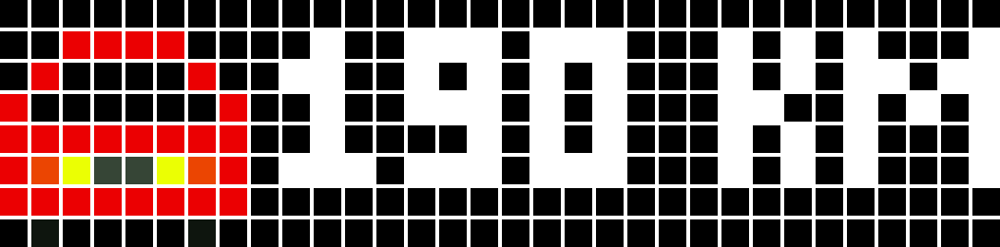
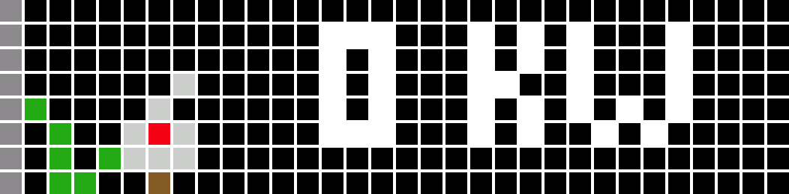
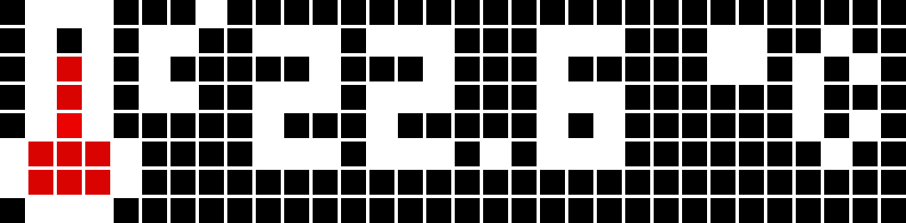
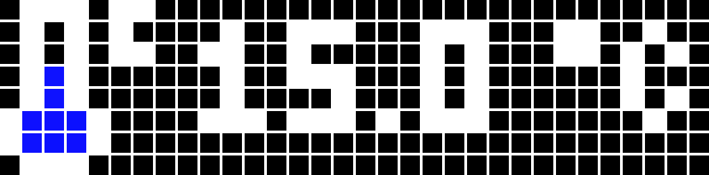
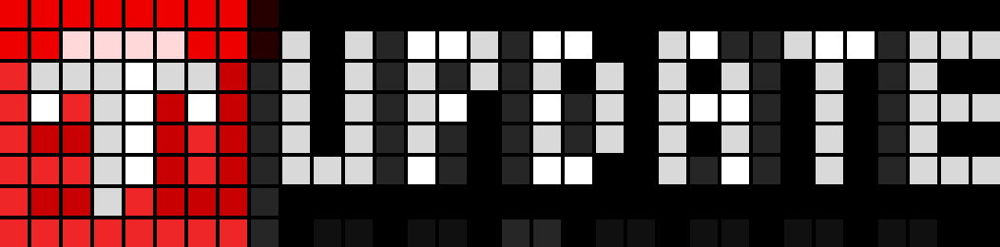

# TeslaMate AWTRIX 3 node-RED flow
Show [TeslaMate](https://github.com/teslamate-org/teslamate) data to your [AWTRIX 3](https://blueforcer.github.io/awtrix3/) flashed [Ulanzi TC001 Smart Pixel Clock](https://www.ulanzi.de/products/ulanzi-pixel-smart-uhr-2882?ref=stnk).

## Implemented screens/apps

### Distance / geofence

Show distance from home.

In case you defined geofence, it will be shown instead.

### Battery SOC

See battery SOC of your car.

### Rated battery range

Show rated battery range.

### Charge power

See the charge power if your car is charging.

### Inside temperature

See the car's inside temperature (red icon).

### Outside temperature

See the car's outside temperature (blue icon).

### Software update

If there is a new Update for your Tesla, you'll get notified for which car (display name) and which version is installed and which new version is available.

## Prerequisites

### Hardware

You need a device that can be [flashed with AWTRIX 3](https://blueforcer.github.io/awtrix3/). Right now this is the [Ulanzi TC001 Smart Pixel Clock](https://www.ulanzi.de/products/ulanzi-pixel-smart-uhr-2882?ref=stnk). Flashing instructions can be found [here](https://blueforcer.github.io/awtrix3/#/quickstart).

I have it plugged to the wall with a 2 amps adapter ([something like this](https://amzn.to/3YOrcql)). I also have plugged a timer ([something like this](https://amzn.to/4fgebLm)) in between to charge and discharge the TC001 internal battery. So it does not keep fully charged over time.

You can also use DIY hardware. Please refer to the [website of the AWTRIX 3 maintainer](https://blueforcer.github.io/awtrix3/).

### Software

You need already set up and running:
- Teslamate (https://docs.teslamate.org/docs/installation/docker)
- AWTRIX 3 flashed device (https://blueforcer.github.io/awtrix3/)
- MQTT broker like Mosquitto (https://mosquitto.org/)
- Mode-RED (https://nodered.org/)

## Installation

### Setup MQTT broker
1. If you have a standard installation of TeslaMade, Mosquitto MQTT is already running.
2. You should now see TeslaMate publishing information to MQTT. You may use something like "MQTT Explorer" (https://mqtt-explorer.com/) to connect to your MQTT broker and check if you see "teslamate" topics.
3. Connect the AWTRIX device to your MQTT server by going to the IP adresss of the device and choose "MQTT" in menu. Enter MQTT information and remember the "prefix". You'll need it later in the Node-RED flow.
4. You should now see the AWTRIX device publishing information to MQTT. Check for the "prefix" topic. 

### Import the flow and do relevant changes

1. Download the JSON file and import it to Node-RED by clicking the burger menu and choose "import".
2. Change the variable "awtrix_prefix" in the "vars" node to the MQTT topic of your AWTRIX device (remember the "prefix").
3. Change variables for your home coordinates ("home_longitude", "home latitude") in "vars" node for distance calculation.
4. Also change the MQTT server settings in Node-RED to your MQTT server (see right side settings icon "MQTT"). Or delete it if you already have one configured for other flows.
5. Click "deploy" to save everything and see it running.
6. Node-RED will now write the apps to your AWTRIX device (see "custom" folder) and the apps will show up.

### Download icons to the AWTRIX device

Download all icons used by the flow to your AWTRIX device by going to the IP address of the device and choose "Icons" in menu. Download all icons by using the icon ID. You can find all icon IDs in the "Readme.1st" node of the already imported flow.

Now all apps will have an icon.

## Flow modifications and updates

Feel free to change the imported flow to your own needs. You may want to add a 2nd car. You may also change the icons. Check the "Readme.1st" node for further information. - Enjoy it. :-)

In case I update the flow due to calculation changes or fixing bugs, you need to import the whole flow again to Node-RED. It will automatically import as a new flow, so you won't loose your mods. You need to check on your own what has been changed or transfer your mods.

## Credits

Distance calculation is taken from [Jörg Hofmann](https://meintechblog.de/).

## Known issues and limitations

### Issues

- Maybe old information will be shown before new data is pulled from the MQTT broker during startup of the AWTRIX device. This seems to be due to caching or the device or Node-RED does not recognize new data. This will need a few minutes then.

### Limitations

- As the MQTT broker is the service in between, everything relies on MQTT. If there is no new data pushed from other systems (in this case TeslaMate) to MQTT, the device will not show the information anymore after a few times because Node-RED will only pull new data. - This can be fixed with an "inject" node which triggers to push the app data again to MQTT for the AWTRIX device. See "batterySocCar1" for reference.
- Yet I did not find out how to cope with changed MQTT data Node-RED misses. Please let me know if you have a solution.
- Distance calculation does give direkt distance and not distance on the road.

## Changelog

#### 2024-10-30

- Initial version